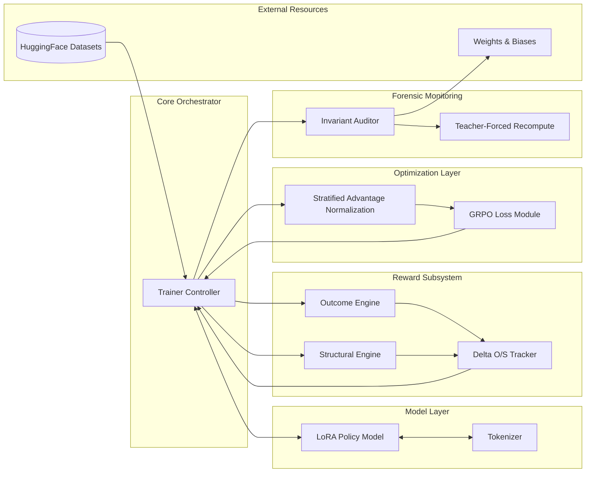
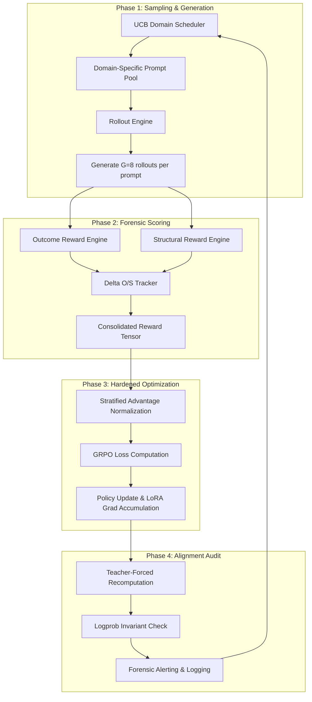
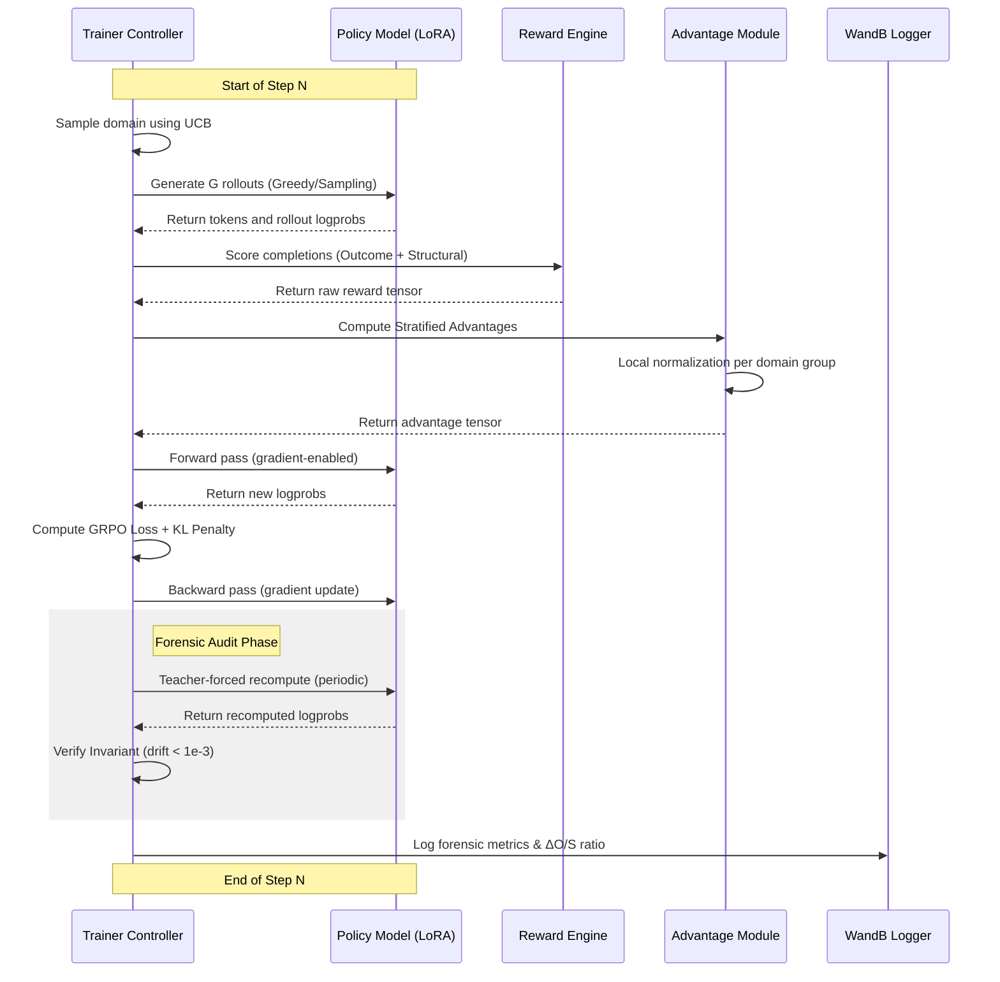

# StrataRL: Forensic-Grade GRPO Infrastructure

## 1. Introduction
StrataRL is a research-grade reinforcement learning framework designed to solve the stability and scaling challenges inherent in training reasoning models. Unlike standard RL pipelines that often suffer from catastrophic forgetting, mode collapse, or reward hacking, StrataRL implements a multi-layered defense system combining Group Relative Policy Optimization (GRPO) with Stratified Advantage Normalization (SAN).

The project is built on the philosophy that training reasoning models is primarily a search-and-stability problem rather than a simple optimization problem. Every component is designed to maintain high-fidelity gradients while suppressing the noise generated by long-horizon rollouts.

## 2. Architecture and Data Flow

### 2.1. High-Level System Architecture
The following diagram describes the functional boundaries and component relationships within the StrataRL ecosystem.



### 2.2. System Data Flow
The following flowchart illustrates the iterative process of domain sampling, generation, and hardened optimization.



### 2.3. Training Sequence Diagram
This diagram shows the interactions between the training controller and the model components during a single step.



## 3. Core Algorithmic Components

### 3.1. Group Relative Policy Optimization (GRPO)
StrataRL uses a modified GRPO objective that eliminates the need for a separate, frozen reference model. Instead, it utilizes the old policy (pi_old) from the beginning of the rollout phase as the reference.

**Thinking:** Standard RLHF requires loading two copies of the model (policy and reference), which doubles VRAM usage. By utilizing the logprobs generated during the rollout phase as the reference signal, we recover significant compute resources while ensuring that the KL penalty remains mathematically valid over the course of the update.

### 3.2. Stratified Advantage Normalization (SAN)
SAN addresses the "Dominant Domain Problem" where a model ignores hard tasks (e.g., calculus) to maximize rewards on easy tasks (e.g., basic arithmetic) because the easy tasks provide a "louder" signal.

**Thinking:** By normalizing advantages within strata (domains), we ensure that the model receives a consistent signal to improve on every task, regardless of the absolute reward scale or variance of that specific domain.

## 4. Forensic Hardening: Features and Rationales

### I-1: GDPO Normalization and Annealed Noise
Standard normalization fails when a group has zero variance (e.g., all rollouts are wrong).
- **Implementation:** Adds a small amount of Gaussian noise that is annealed over time (starting at 0.02 and floor at 0.004).
- **Rationale:** This prevents the gradient from exploding or becoming NaN when the model is in a "low information" state during early training.

### I-2: Reference-Free KL and Sampled Gap
Instead of a formal KL model, we track the `sampled_logprob_gap`.
- **Implementation:** L_kl = beta * mean(log(pi_theta) - log(pi_old)).
- **Rationale:** This ensures that the penalty is directly tied to the drift from the exact tokens generated during rollouts, which is more robust than estimating KL over the entire vocabulary.

### I-3: Teacher-Forced Recomputation
Large-scale training often suffers from "activation drift" where the logprobs stored during rollout no longer match the logprobs computed during the backward pass due to floating-point accumulation.
- **Implementation:** Every N steps, the system performs a non-gradient forward pass on the rollout tokens to verify that the delta is below 1e-3.
- **Rationale:** This acts as a circuit breaker for hardware-level or numerical instability before it corrupts the weights permanently.

### I-4: Delta_O/S Tracker
Reasoning models often learn to "hack" the structural reward (formatting) without actually solving the problem (outcome).
- **Implementation:** Tracks the ratio of structural reward improvement to outcome reward improvement.
- **Rationale:** If structural reward skyrockets while outcome remains flat, the system automatically shifts the weight (w_outcome) to force the model back toward semantic correctness.

### I-8: Prompt-Region Contamination Assertion
A common bug in RL packing logic is including the prompt tokens in the loss calculation, which "unlearns" the fixed prompt and causes the model to diverge.
- **Implementation:** A strict assertion verifies that the logprobs of the prompt region in the policy update tensor are exactly zero.
- **Rationale:** This is a zero-tolerance guardrail against the most common cause of RL mode collapse.

## 5. Deployment Guide: Full Kaggle Run

This section details the step-by-step procedure for migrating the 3B model to a Kaggle CUDA environment for 1000-step training.

### Step 1: Environment Preparation
In your Kaggle notebook, ensure the virtual environment is correctly mapped and the project is in the PYTHONPATH.

```python
# Kaggle initialization block
import os, sys
os.environ['PYTHONPATH'] = '/kaggle/working/StrataRL'
sys.path.append('/kaggle/working/StrataRL')
```

### Step 2: Configuration Verification
Generate the production config and run the audit script to ensure CUDA-specific optimizations are enabled.

```bash
# Generate the config
python3 scripts/generate_kaggle_config.py

# Run the forensic audit
python3 scripts/audit_config.py --config configs/exp_01_kaggle.yaml
```

### Step 3: Establish Actual Baselines
Measure the performance of the un-trained 3B model. This is critical for calculating final deltas.

```bash
python3 scripts/measure_baseline.py --model Qwen/Qwen2.5-3B-Instruct --n_samples 200
```

### Step 4: Execute Production Run (EXP_01)
Launch the 1000-step training loop. This run utilizes Unsloth for 2x faster training and 4-bit quantization to fit G=8 rollouts on a P100/T4 GPU.

```bash
python3 m4/m4_train.py --config configs/exp_01_kaggle.yaml
```

### Step 5: Post-Training Evaluation
After completion, the system will save the LoRA adapters to `./outputs/final/`. Run the final benchmark to verify the reasoning improvement.

```bash
python3 scripts/measure_baseline.py --model ./outputs/final/ --benchmarks gsm8k mmlu strategyqa
```

## 6. Design Decisions and Tradeoffs

### 6.1. Reference-Free vs. Frozen Reference
- **Tradeoff:** Using pi_old as a reference is more memory-efficient but requires a "trust region" to ensure the policy doesn't move too far in a single step.
- **Decision:** StrataRL opts for memory efficiency to allow for larger batch sizes (G=8) and higher-parameter models (3B) on commodity hardware, relying on the detached KL normalization to maintain stability.

### 6.2. Local Verification (M4) vs. Production (CUDA)
- **Tradeoff:** Local M-series Macs lack the specific optimizations (FlashAttention2, Unsloth) available on CUDA.
- **Decision:** The project maintains a dual-mode engine. The M4 mode uses vanilla PyTorch/MPS for architectural verification, while the production configs utilize Unsloth and 4-bit quantization for efficiency.
